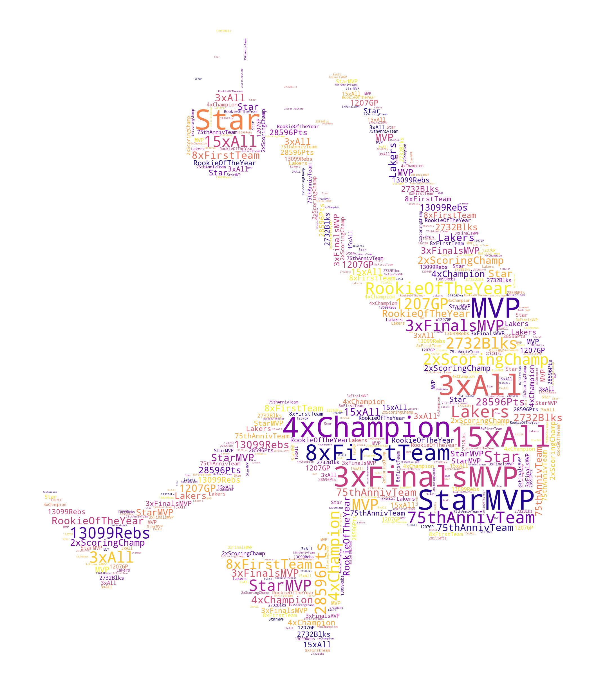

### <a id='overview'>1. Overview</a>

#### Motivation
- To create word clouds that give a glance of the achievement of the NBA legend Shaquille O'Neal. 
- Shaq particularly suits for creation of word clouds due to his signature dunk
- The final word cloud is filled with Shaq's **NBA** accomplishment and is shown below.

#### Method
- The word clouds were created with the [word cloud library](https://amueller.github.io/word_cloud/auto_examples/index.html).  
- Shaq's NBA achievement data was pulled from [wiki pages](https://en.wikipedia.org/wiki/Shaquille_O%27Neal) and [NBA All Time leader page](https://www.nba.com/stats/alltime-leaders/)
- The color map is chosen so it closely match the color purple and gold in Los Angeles Lakers' uniform, at which Shaq played the majority of his career.

### <a id='sam'>2. About the author: Kam Leung Yeung (Sam)</a>
* PhD in Cognitive Psychology, Iowa State University in Ames, Iowa, USA

**Social media**:

* [LinkedIn](https://www.linkedin.com/in/kamleungyeung/)
* [Google Scholar](https://scholar.google.com/citations?user=OwUmaN8AAAAJ)
* [GitHub](https://github.com/k-l-yeung)
* [Tableau](https://public.tableau.com/app/profile/kam.leung.yeung#!/)

#### Other notes
- Mask preprocessing hint: change the mask photo to black and white image first  
- Color scheme / map can be chosen at [matplotlib colormap](https://matplotlib.org/stable/tutorials/colors/colormaps.html)  
